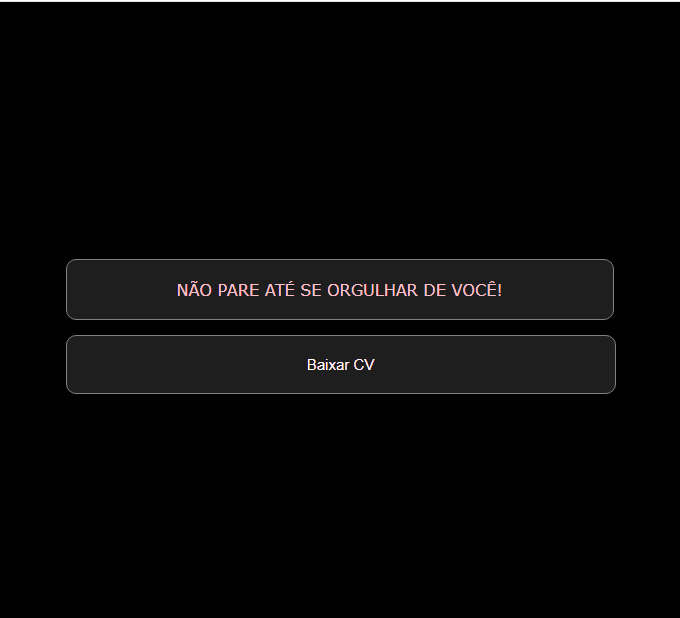

# Quest React Base
Desafio proposto no curso DevQuest - devEmDobro, no módulo de React base.

## Desafio 💻
🟣 Criar um parágrafo
- Deveria ser criado um componente (com um bom nome).
- Esse componente deveria renderizado na tela um parágrafo colorido e com todas as letras maiúsculas usando JS.
- Usando as props para passar o texto e a cor de texto desejado para dentro do componente.

🟣 Criar um botão
- Deveria ser criado um componente Button com um evento de clique que apresente um alerta informando a prop label do botão que
foi clicado, com a seguinte mensagem: "A label desse botão é baixar CV.
## Técnologias utilizadas

## Layout

